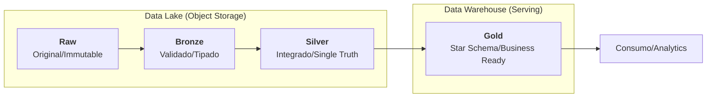
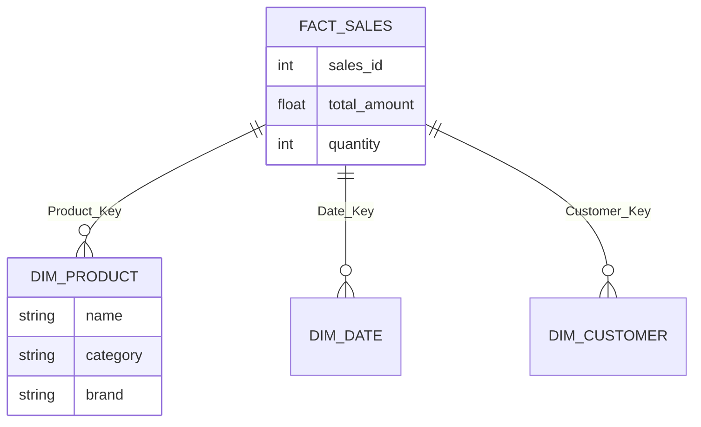
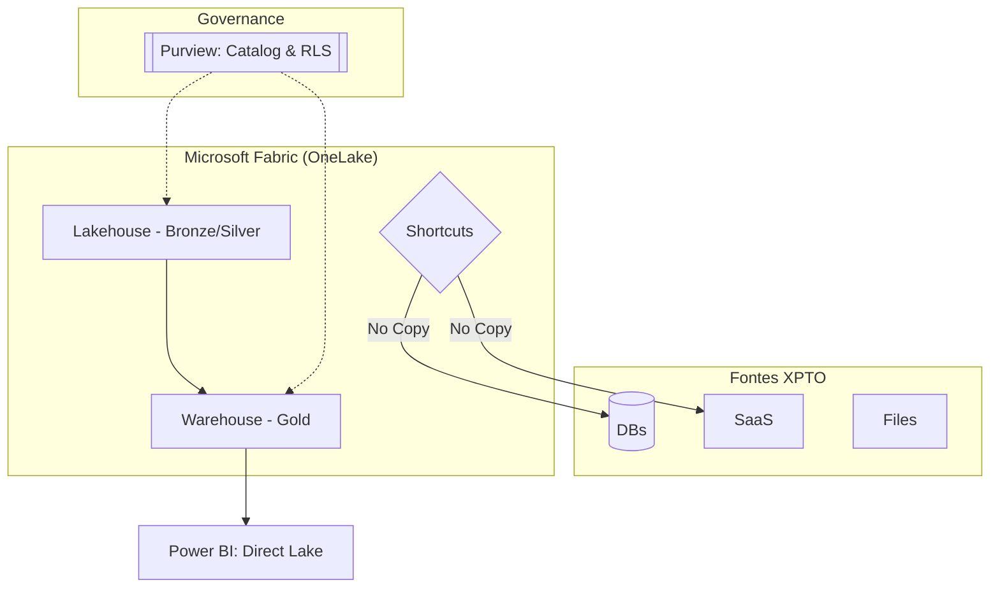
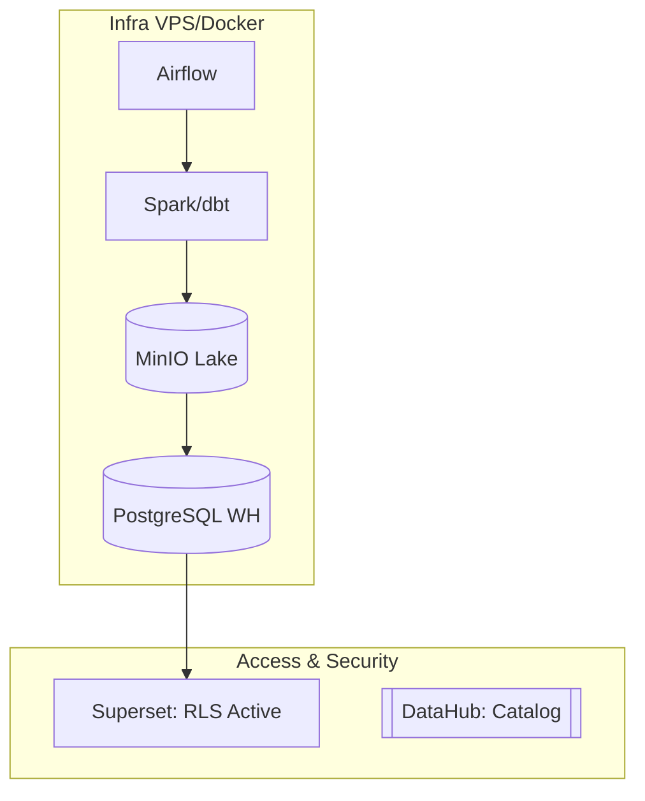

# CLAUDE.md - Case Técnico XPTO (Data Platform & Governance)

## 🎯 Objetivo do Projeto

Demonstrar senioridade em Arquitetura de Dados através de uma solução robusta, escalável e governada para a XPTO (+50 sistemas). O site atua como suporte visual para uma defesa técnica de 15 minutos, focando na recomendação do **Microsoft Fabric** vs. a alternativa **Open Source**, evidenciando fundamentos de engenharia (Medalhão, Star Schema) e segurança (RLS).

## 🛠 Tech Stack & Padrões

- **Framework:** React (Vite) + Tailwind CSS (Dark/Light Mode via classe `dark`).
- **Diagramas:** `Mermaid.js` (Diagram-as-Code) para renderização dinâmica e traduzível.
- **Roteamento & i18n:** `React Router DOM` com estrutura de URL `/:lang/:page`.
- **Animações:** `Framer Motion` para scroll storytelling.
- **Ícones:** `Lucide React`.

## 🌐 Internacionalização (i18n)

- **Dicionários:** `src/i18n/pt.json`, `src/i18n/en.json`, `src/i18n/es.json`.
- **Lógica de URL:** `site.com/pt/`, `site.com/en/`, `site.com/es/`.
- **Comportamento:** O estado do idioma é reativo à URL. Caso não haja prefixo, redirecionar para `/pt/`.

---

## 📂 Arquitetura de Páginas & Storytelling

### 1. Home (O Diagnóstico e a Base)

- **Hero:** Proposta de valor e impacto imediato.
- **Problem Context:** Grid detalhando o caos dos 50+ sistemas e silos.
- **Medallion Architecture (Mermaid):** Fluxo Raw → Bronze → Silver → Gold, separando fisicamente o Data Lake (Storage) do Data Warehouse (Analytics).
- **Modeling: Star Schema vs. Snowflake:**
  - Seção comparativa explicando por que a camada **Gold** utiliza **Star Schema** (Desnormalizado):
    1. **Performance:** Redução drástica de JOINs em queries analíticas.
    2. **Usabilidade:** Intuitivo para usuários de negócio (Self-service).
    3. **Manutenibilidade:** Facilita a criação de medidas e KPIs consistentes.
- **Comparison Table:** Matriz de decisão (TCO, Governance, Time-to-market).

### 2. Páginas de Caminho (Fabric & Open Source) - Simetria de Defesa

_Ambas as páginas seguem a mesma estrutura para permitir comparação direta:_

- **Diagrama de Arquitetura (Mermaid):** Detalhamento técnico específico da stack.
- **Formas de Acesso (Consumo):**
  - **Fabric:** Power BI (Direct Lake), SQL Endpoint (T-SQL), Notebooks (Python/Spark).
  - **Open Source:** Apache Superset (Dashboards), Trino (Queries federadas), dbt Docs.
- **Segurança & Governança (RLS):**
  - Explicação técnica de como garantir que o usuário X veja apenas os dados da região Y através de **Row-Level Security** implementado na camada de Serving.
- **Cronograma & Roadmap:** Timeline de implantação e visão de futuro (AI/ML).

---

## 📊 Diagramas Mermaid Integrados

### A. Arquitetura Medalhão (Conceito)

### B. Modelagem Dimensional (Star Schema)

### C. Stack Recomendada: Microsoft Fabric

### D. Stack Alternativa: Open Source

---

## 🚀 Workflow & Regras de Desenvolvimento

1. **Implementação do Mermaid:**
   - Criar componente `Mermaid.jsx` usando `mermaid.initialize` com suporte a temas.
   - Traduzir labels injetando as chaves do `translation.json` nas strings do diagrama.
2. **Dark Mode:**
   - Utilizar classes `dark:bg-slate-950` e `dark:text-white`.
   - Ajustar `mermaid.theme` para `dark` dinamicamente.
3. **Responsividade:**
   - Mobile: Tabelas viram cards verticais; Diagramas ganham scroll horizontal.
4. **Governança via RLS:**
   - O conteúdo deve destacar que a RLS é aplicada na **Gold**, garantindo que a "Democratização" citada no desafio não comprometa a segurança.

## ⚠️ Manutenção

- Todas as strings técnicas (Star Schema, TCO, RLS, Medallion) **devem** estar nos dicionários para garantir precisão nas versões EN e ES.
- Evitar o uso de imagens estáticas; priorizar `Mermaid.js` e `Lucide Icons`.
